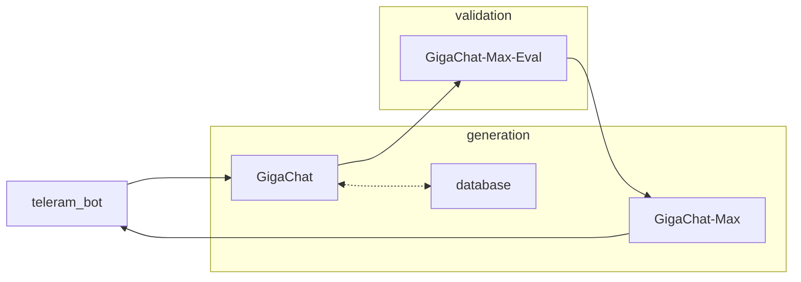

В ветке master лежит музейный гид Словцова, готовый для тестого деплоя. 
Для запсука требуется docke. Команда: docker compose up --build -d

Для постоянного деплоя предлагаем вариант на ветке tretiakovka. Он включает весь функционал. Является демо-версией, которую могут попробовать и дргуие потенциальные заказчики. На данный момент требует минимальной доработки.

# ИИ-гид

## Scheme

